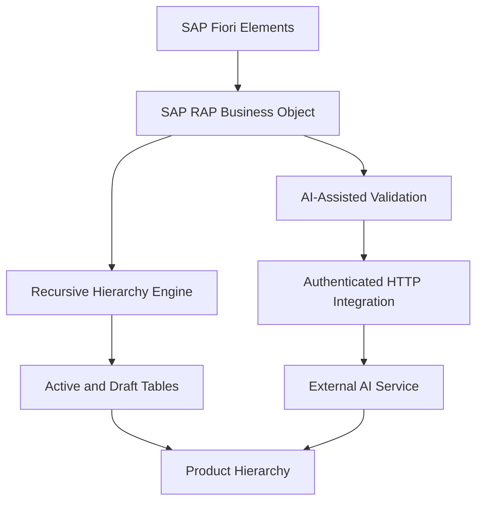
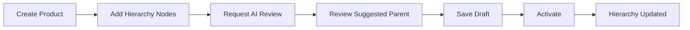

# SAP RAP AI Recursive Product Hierarchy

Proof-of-concept SAP ABAP RAP application combining a draft-enabled recursive
product hierarchy with optional AI-assisted validation and hierarchy
generation.

This repository demonstrates how SAP RAP can be extended with AI-assisted
hierarchy recommendations, recursive business object modeling, draft
processing, and external service integration to explore real-world master data
governance scenarios.

## Architecture

The RAP business object remains responsible for transactional consistency,
draft processing, actions, and deterministic validation. AI review is optional
and advisory; it runs only after deterministic hierarchy checks succeed.

## Demo flow

## Core RAP model

- `ZI_Product_I` is the product root entity.
- `ZI_ProductHierarchy_I` is a recursive child entity.
- `_Parent` is a self-association to the parent hierarchy node.
- `_Children` is a self-association to descendant nodes.
- Active and draft persistence are provided for products and hierarchy nodes.
- `ZUI_PRODUCT_V4` exposes the Fiori elements application through OData V4.
- `ZR_PRODUCT_RECURSIVE_DEMO` creates demonstration products and three-level
  hierarchies.

## AI extension

`ZCL_PRODUCT_HIERARCHY_AI` adds:

- Deterministic checks for required fields, duplicate node IDs, missing parent
  references, self-parenting, and recursive cycles
- Structured advisory model review after deterministic validation succeeds
- Grounded concern details including affected node, current parent, optional
  suggested parent, reason, confidence band, and required human review
- Generated hierarchy suggestions returned as JSON for user review

`ZCL_PRODUCT_HIERARCHY_AI_HTTP` provides an authenticated JSON API using
generic SAP HTTP classes. Credentials and hosts remain in the
administrator-controlled `ZPRODUCT_HIER_AI_URL` setting or
`ZPRODUCT_HIER_AI` HTTP destination and are never accepted from callers.
Controlled ABAP callers can alternatively provide an HTTPS URL template,
deployment, model, and runtime-only API key directly to the AI class.

The Fiori elements product list and object page expose **Validate Hierarchy**
and **Review with AI** instance-action buttons. AI concerns appear as warnings;
responses that report no semantic concern remain informational.

See [docs/AI_HIERARCHY.md](docs/AI_HIERARCHY.md) for configuration and request
examples.

## Enterprise patterns demonstrated

- Recursive RAP modeling with parent and child self-associations
- Draft-enabled transactional processing
- Managed RAP business objects
- Deterministic hierarchy validations
- Instance actions for hierarchy validation and AI review
- ETags and draft-conflict protection
- Fiori elements annotations and action exposure
- Authenticated HTTP integration
- Runtime-controlled external service configuration
- AI-assisted recommendations with deterministic guardrails
- OData V4 service exposure
- abapGit-compatible source and metadata

This is a learning and demonstration project. Validate APIs, released ABAP
language features, service exposure, security controls, and deployment
requirements against the target SAP environment before treating any pattern as
production- or cloud-ready.

## Import

1. Import the repository through abapGit into an appropriate test package.
2. Activate all objects and resolve target-system dependencies.
3. Publish service binding `ZUI_PRODUCT_V4`.
4. Run `ZR_PRODUCT_RECURSIVE_DEMO` to create sample data.
5. Configure the AI destination and authenticated SICF handler only when the
   optional AI extension is required.

The demo report defaults to a non-reset run. Its reset option refuses to
replace active `DEMO_%` data while a corresponding RAP draft exists, preventing
stale-draft ETag conflicts.

Review authorization, service exposure, generated suggestions, and target SAP
release compatibility before production use.
